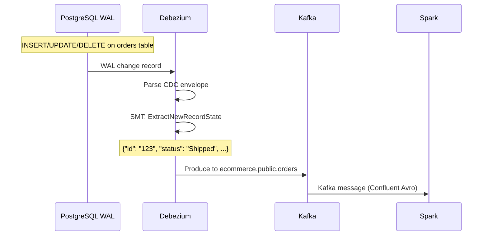

# Datasource — CDC Pipeline

## End-to-End Flow

```
PostgreSQL (WAL)
    │  pgoutput plugin
    ▼
Debezium Connector (ExtractNewRecordState SMT)
    │  Unwraps CDC envelope → Avro
    ▼
Apache Kafka (ecommerce.public.*)
    │  CDC entity topics + heartbeat
    ▼
Spark Structured Streaming (`workspace/stream_processor.py`)
    │  Schema Registry lookup + from_avro(), then write to Delta
    ▼
Delta Lake s3a://lakehouse/staging/
```

## PostgreSQL Source

| Table | CDC? | Description |
|-------|------|-------------|
| `orders` | Yes | Order header with status lifecycle |
| `order_items` | Yes | Line items per order |
| `events` | Yes | Web/app session events |
| `users` | Yes | User registrations |
| `products` | Initial | Product catalog (static) |
| `dist_centers` | Initial | Distribution centers (static) |
| `heartbeat` | Yes | WAL keepalive (prevents slot growth) |

### WAL Configuration

```bash
wal_level=logical          # Enable logical replication
max_replication_slots=4    # Capacity for logical replication slots
max_wal_senders=4
```

## Debezium Connector

**Config:** `infra/debezium/conf/ecommerce-postgres.json`

### How CDC Works



### Key Connector Settings

```json
{
  "connector.class": "io.debezium.connector.postgresql.PostgresConnector",
  "plugin.name": "pgoutput",
  "database.hostname": "postgres",
  "database.dbname": "ecommerce",
  "topic.prefix": "ecommerce",
  "slot.name": "debezium_ecommerce_slot",
  "publication.name": "debezium_ecommerce_pub",
  "publication.autocreate.mode": "filtered",
  "schema.include.list": "public",
  "table.include.list": "public.users,public.orders,public.order_items,public.events,public.heartbeat",
  "snapshot.mode": "initial",
  "transforms": "unwrap",
  "transforms.unwrap.type": "io.debezium.transforms.ExtractNewRecordState",
  "transforms.unwrap.add.fields": "op,ts_ms",
  "value.converter": "io.confluent.connect.avro.AvroConverter",
  "value.converter.schema.registry.url": "http://schema-registry:8081"
}
```

### SMT: ExtractNewRecordState

The SMT unwraps the Debezium CDC envelope. Before SMT, each Kafka message looks like:

```json
{
  "before": null,
  "after": {"id": "123", "status": "Processing", "user_id": "456", ...},
  "op": "c",
  "ts_ms": 1712345678901
}
```

After the Debezium unwrap SMT, Kafka values use **Confluent Avro**. Business columns are flattened and CDC metadata fields such as operation/timestamp are added for downstream processing:

```json
{"id": "123", "status": "Processing", "user_id": "456", ...}
```

Spark reads the embedded Schema Registry ID and decodes the payload with `from_avro()`.

### Heartbeat

```json
"heartbeat.interval.ms": "10000",
"heartbeat.action.query": "INSERT INTO public.heartbeat (id, ts) VALUES (1, NOW()) ON CONFLICT (id) DO UPDATE SET ts = NOW()"
```

Inserts a heartbeat row every 10 seconds if no CDC events occur. This keeps the replication slot active and prevents WAL from growing unbounded.

## Kafka Topics

| Topic | Partitioned by | Notes |
|-------|---------------|-------|
| `ecommerce.public.orders` | `id` | Order lifecycle events |
| `ecommerce.public.order_items` | `order_id` | Line item changes |
| `ecommerce.public.events` | `id` | Web/app events |
| `ecommerce.public.users` | `id` | User registrations |
| `ecommerce.public.heartbeat` | `id` | Keepalive messages |

Topic naming: `{topic.prefix}.{schema}.{table}`. Product and distribution-center reference tables are loaded directly from PostgreSQL into Delta by Spark rather than streamed through Debezium.

## Spark Structured Streaming

The runnable stream processor is `workspace/stream_processor.py`; the notebook is a thin launcher around the same code.

### Kafka ingestion

Each CDC topic is read with a dedicated checkpoint. `startingOffsets="earliest"` is intentional: on the first run the lakehouse can build complete state from retained Kafka history, while subsequent runs resume from the stored checkpoint.

```python
raw = (
    spark.readStream.format("kafka")
    .option("kafka.bootstrap.servers", "kafka:9092")
    .option("subscribe", "ecommerce.public.orders")
    .option("startingOffsets", "earliest")
    .option("failOnDataLoss", "false")
    .load()
)
```

Checkpoint state, not the `startingOffsets` value, controls normal restart position once a query has run successfully.

### Avro schema guard

The Confluent wire header contains the Schema Registry ID. Spark extracts that ID before decoding. Only the currently approved schema ID is decoded; new IDs are routed to quarantine and logged as schema drift.

```text
Kafka value
  -> schema id check
      -> approved: Avro decode -> validation -> Delta MERGE
      -> unapproved: raw record -> Delta quarantine
```

### Delta merge

Valid inserts/updates are merged into the staging Delta table by entity `id`. Deletes remove the matching entity. Kafka partition/offset and CDC lag are stored as operational metadata.

Because current state is maintained with `MERGE`, restarting from an existing checkpoint does not create duplicate entity rows.

### Bad-record quarantine

Invalid records are written to `delta.quarantine.cdc_bad_records` with their original Kafka key/value, topic, partition, offset, schema ID, failure reason and timestamp. This preserves the exact event for later replay.

### CDC lag metrics

Every micro-batch writes processed count, quarantine count, maximum lag, average lag and latest offset to `delta.monitoring.cdc_batch_metrics`.

See `docs/reliability.md` for schema-drift and replay details.


## Ghost Events

Events with `user_id IS NULL` are valid anonymous browsing sessions. They are:
- Written to `staging.events` normally
- Flagged `is_ghost=true` in `intermediate_events`
- Excluded from `fct_sessions` (sessions need a user)
- Included in raw `fct_events` counts
